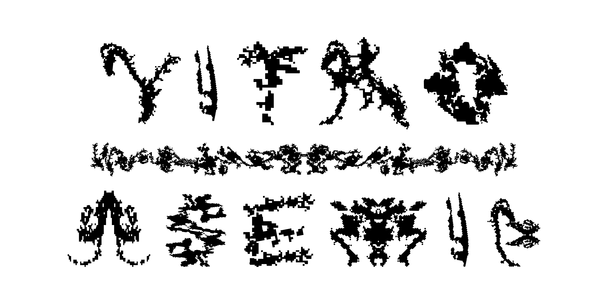
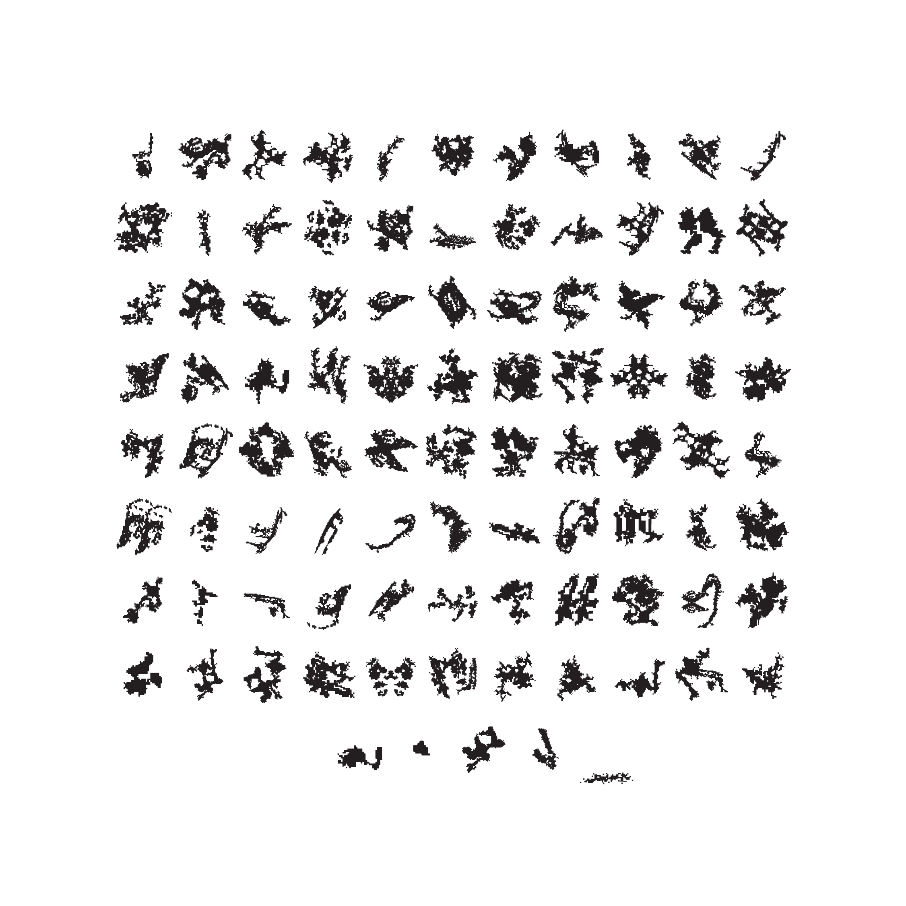
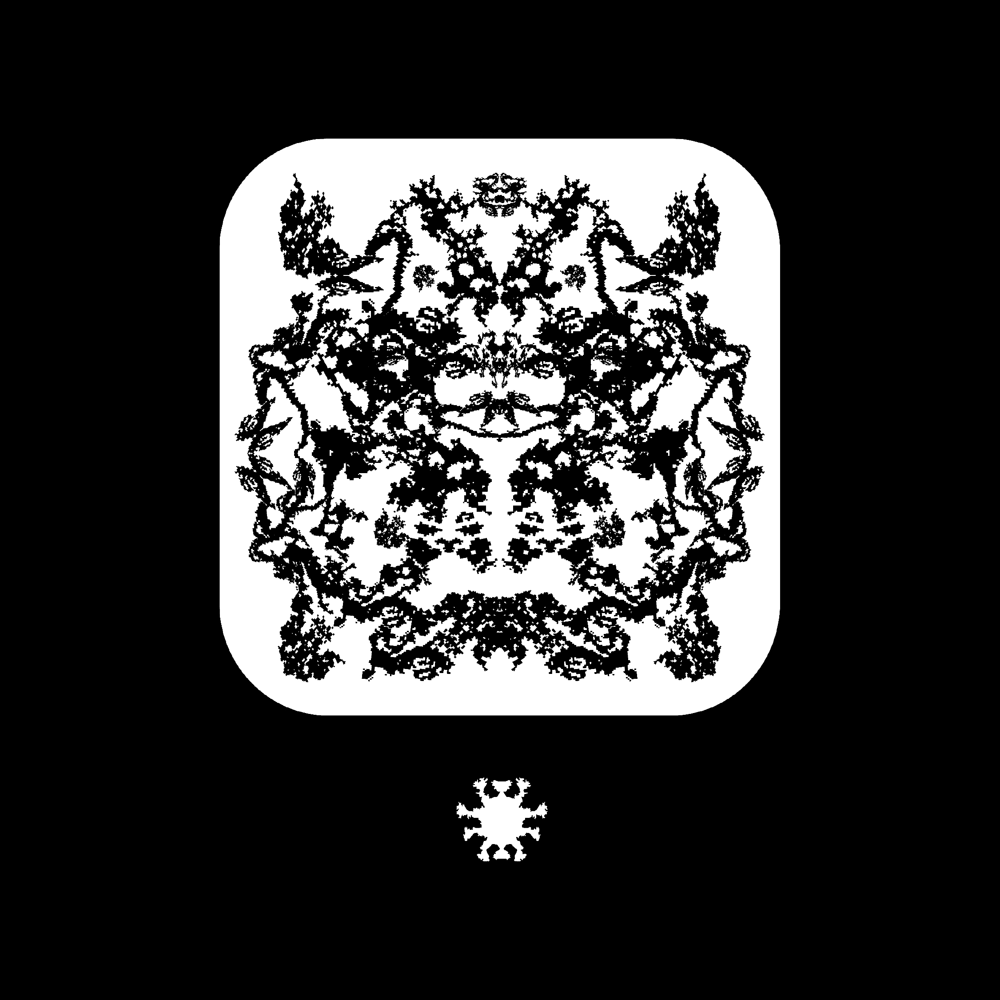

# VITRO-ASEMIC

    

    

VITRO-ASEMIC is an artifact for my graphic design capstone project and is a working .otf font that you can download for free on here. I only ask that you attribute my name either through my [Instagram](https://instagram.com/thomaskrajna_artist) or though my [website](https://www.thomaskrajna.com/). I also have an inspiration board [here](https://pin.it/39A13uk) for this project as well. 

This work came from the inspiration of the "hidden" world of bacteria and influences from biomimicry. VITRO-ASEMIC was also in response to the manifesto below. Each of the glyphs within the dingbat font came from the digitization of several petri dishes over the span of 3 days that were marked within the forms of the 7 typetoms.

The term asemic which is used to categorize the title of this font acts as a language or communication that is beyond our understanding but still hails to the referent. This can be seen within the nutrient of agar communicating with the bacteria from the source of my cheek to form visual clusters. The participant’s framework of syntax can be virtualized within alternations of communication through the semiotic process. This aspect is also named by another term that I used within my own art practice which is cognitive estrangement. This font was created to utilize the asemic and cognitive estrangement in order to generate further ecological grounding. In correlation to the hailing of the asemic, this font hails towards the non-human for a ritualized dialectic.

This work is being commenced on 5/5/22 during the beginning of the graphic design capstone show for University of Wisconsin-Milwaukee. 

   

	POSTHUMAN (DE)SIGN AMONG THE NON-HUMAN MANIFESTO
        
        Definitions
    	Posthuman: A critique of enlightenment humanism for a synthesis of new defining characteristics
    	Non-human: The things outside the bounds of the colloquial term “human”
    	(De)sign: Meaning creation for the referent

        PROCLAMATION OF AXIOMS
            1. (De)sign beyond the function
            2. (De)sign beyond the human
            3. Immaterial communication is more important than material communication: Geist dance
            4. The mark can seduce essence entrapment: know how memories can be incubated
            5. Consciousness creates reality through symbolic and imaginary realms  
            6. Use the non-human as an aid
            7. Invisibility can be a designer’s curse or spell
    
Technology originates as our will and becomes transferred through the medium of the form. For example, a human that has limited eyesight could desire technology for an alternation on their base human abilities. This means that we are already posthuman in which (de)sign needs to re-envision this human-centered cognitive apparatus. To reconcile this is one goal of posthuman (de)sign. It has been since the beginning, designers have used the outside world to create shelter as in mud for an example and from that (de)sign has accelerated. The non-human such as ideals, ecologies, mud, and spectacles can all aid the designer. The rejection of agency within marks and objects has haunted the (de)sign field and for its betterment the designer shall become beyond their own subject and towards a collective consciousness of subjectivities.

   

